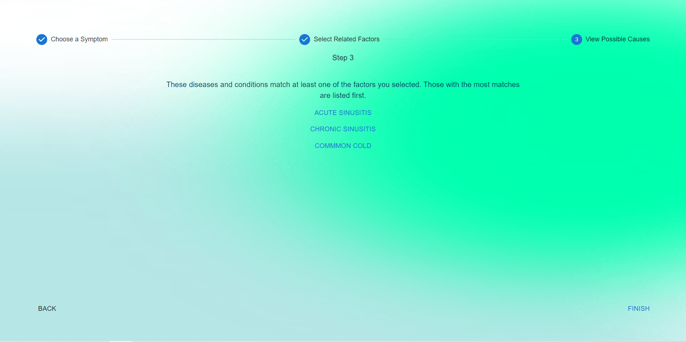

## Team GoalDiggers : KJSCE Hackathon

### SYMPTOM CHECKER
A tool to help you in figuring out which medicines you would require for the symptoms you have, our responses are developed on an intelligent and accurate model-based classification.

### The problem SYMPTOM CHECKER solves ###
In today's world, no one knows what one might be affected with and what underlying symptom that we consider a mild one might lead to a major disease. A common person tends to take home remedies for small symptoms. What we do not know is, sometimes shortness of breath and sweat that we consider just getting tired is actually a symptom of an upcoming heart attack. We, at goal diggers, have used an extensive database that maps the numerous symptoms of various diseases and as and how you select your symptoms more aptly, the prediction of your disease would get more accurate. The first step that we make you do is select your age group and some minor details about you which is then followed by what kind of symptoms you are experiencing right now. Once you have selected all those symptoms, our model runs through the database and maps those symptoms to an accurately predicted disease. Once that is done, we use another database, a database of almost all available medicines, and we iterate through those to find the medicines that you should take/receive for the treatment. We search for the therapeutic classification and the uses of the medicines and map it according to the disease mentioned. Once that is done and we have presented you with the disease and the medicines, we also provide you with the brand name of that medicine, the corresponding MRP, and the FAQs related to that medicine. This helps the user become more aware of the medicine and its potential side effects as well as other common doubts. All in all, when certain households prefer not to contact a doctor over certain symptoms, we provide an accurate platform for everyone to check what disease they are affected with and what medicines they should be taking.

### Challenges we ran into ###
Converting scrapped data which is obtained in form of a CSV, into JSON format.
Integrating Python scripts within the MERN Stack framework.
While trying to use web scraped data, dynamically on the React Web App,
Faced multiple bugs in trying to maintain the state management inside the development environment.
Several headbutts were involved while searching through the humongous database.

## Pages of Our Application

